# clair-pick-and-place-ros2

A ROS 2 workspace for **sim-to-real** pick-and-place with a UR5 arm. This project provides a **high-level execution layer**: **Pick** and **Place** primitives, a **program runner** (ExecuteProgram) for task sequences, and the **Tower of Hanoi** demo—in simulation (Gazebo) or on a real UR5 with OnRobot 2FG7.

---

## Primary use cases

This project is intended for two main workflows:

| Use case | Hardware | Config | Launch | Programs / demos |
|----------|----------|--------|--------|-------------------|
| **1. Real robot** | UR5 arm + **OnRobot 2FG7** gripper | **ur5_4** | `bringup/bringup_ur.launch.py` with `config:=ur5_4` and `robot_ip:=<IP>` | Pick-place, Hanoi demo, etc. Use programs with `EndEffector: "onrobot_2fg7"` (e.g. `ur5_pick_and_place_2fg7`). |
| **2. Simulation** | UR5 + **Robotiq 2F-85** gripper in Gazebo | **ur5_2** | `moveit2.launch.py` with `config:=ur5_2` | Pick-place, Hanoi demo with `EndEffector: "ParallelGripper"` or `"robotiq_2f85"` (e.g. `ur5_pick_and_place`). |

- **Real (1):** External PC runs ROS 2; robot runs the External Control URCap program. Motion via ur_robot_driver + MoveIt 2; gripper via OnRobot 2FG7 backend (URScript/XML-RPC). For config **ur5_4**, the robot description (URDF) intentionally uses **Robotiq 2F-85 geometry** for planning, collision, and visualization; the physical gripper is OnRobot 2FG7 and is controlled via the OnRobot backend. This approximation is documented in `packages/ros2srrc_ur5/config/configurations.yaml`.
- **Real UR5 + Robotiq 2F-85 (config ur5_2):** Supported. Bringup starts the Robotiq gripper server (`ros2_robotiqgripper`) with `robot_ip` so one launch brings up both arm and gripper. If your 2F-85 has a different IP than the robot, do not rely on bringup for the gripper: start the server separately, e.g. `ros2 run ros2_robotiqgripper server.py --ros-args -p IPAddress:=<GRIPPER_IP>`.
- **Sim (2):** Gazebo + MoveIt 2 + ros2_control; same task layer (ExecuteProgram, Pick, Place, Hanoi) with a different gripper model and program YAML.

---

## About

This project introduces a high-level execution layer for pick-and-place: **Pick** and **Place** primitives with configurable poses and approach/retreat, a **program runner** (ExecuteProgram) that executes task sequences (steps like Pick, Place, SetConstraints, SetConfiguration), and the **Tower of Hanoi** demo. The same layer runs in simulation (Gazebo + MoveIt 2) or on a real UR5 with an OnRobot 2FG7 gripper. Under the hood, motion and gripper use MoveIt 2 and the existing action/topic interface (/Move, /Robmove, /Robpose); our layer adds feasibility checks, constraints, configuration steps, and centralized error handling so you work with poses and task sequences instead of low-level motion.

---

## General architecture overview




### Class diagram

HLD-level UML of the execution layer (Pick, Place, robot client, gripper).




**Packages in this workspace:**

| Package | Role |
|--------|------|
| **ros2srrc_launch** | Launch files: Gazebo+MoveIt 2 (simulation), bringup (real UR). |
| **ros2srrc_execution** | C++ nodes (move, robmove, robpose); Python: ExecuteProgram, Pick/Place, Hanoi demo, gripper clients, Spawn/Remove object. |
| **ros2srrc_data** | Custom messages (e.g. Robpose) and actions (Move, Robmove, Sequence). |
| **ros2srrc_moveit** | MoveIt 2 config (SRDF, kinematics) for UR5 and end-effectors. |
| **ros2srrc_robots** | UR5 URDF/xacro, controller YAML. |
| **ros2srrc_endeffectors** | End-effector models (e.g. parallel gripper for sim, OnRobot 2FG7). |
| **ros2srrc_ur5** | Robot/configurations (e.g. ur5_2 for sim, ur5_4 for real UR + 2FG7). |
| **ros2srrc_gazebo** | Gazebo worlds. |
| **gazebo_ros2_control**, **IFRA_LinkAttacher**, **IFRA_ObjectPose** | Simulation and real-robot support (in-tree or referenced). |

## Dependencies

Libraries and packages required to run the project:

* Ubuntu 22.04 LTS, ROS 2 **Humble**
* [MoveIt 2](https://moveit.ros.org/) (`ros-humble-moveit`)
* [ros2_control](https://control.ros.org/) and controllers (`ros-humble-ros2-control`, `ros-humble-ros2-controllers`, `ros-humble-gripper-controllers`)
* [Gazebo](https://gazebosim.org/) and `ros-humble-gazebo-ros-pkgs`
* **ros2srrc_data** (in-tree) – custom messages and actions
* **ros2_linkattacher**, **ros2_objectpose**, **ros2_linkpose** (in-tree, IFRA_*) – Gazebo attach/pose
* For real UR5: [Universal Robots ROS 2 driver](https://github.com/UniversalRobots/Universal_Robots_ROS2_Driver) (`ros-humble-ur`)
* For real UR5 setup (URCap, External Control, networking): see [Real robot setup (UR)](doc/RealRobotSetup.md). **Step-by-step:** [Walkthrough: making the real robot move](doc/RealRobotWalkthrough.md).

## Topics subscribed to

Topics that this project's nodes subscribe to:

1. `/Robpose` – current end-effector pose (used by execution scripts and gripper clients)
2. `/object_poses/<name>` – object pose from Gazebo (`nav_msgs/Odometry`) for pick/place and Hanoi
3. `/<name>/ObjectPose` – object pose for vacuum gripper in Gazebo

## Topics published to

Topics that this project's nodes publish to:

1. `/Robpose` – current end-effector pose (from `robpose` node)
2. `/planning_scene` – planning scene updates (collision objects)
3. `/collision_object` – collision object updates for the planning scene

## Parameters

Parameters that users can change, **introduced by this project**. 

| Parameter   | Meaning | Default | Where declared |
| ----------- | ------- | ------- | --------------- |
| **ROB_PARAM** | Robot planning group name for MoveIt (e.g. `ur5`). | `none` | C++ nodes: move, robmove, robpose |
| **EE_PARAM** | MoveIt group / endeffector name (e.g. `robotiq_2f85` for sim ur5_2 and real ur5_4). Set from config `moveit_ee_group`. | `none` | C++ node: move |
| **robot_ip** | Real robot IP; used by bringup and optionally by 2FG7 backend. | (empty) | robot.py; gripper_onrobot_2fg7.py |
| **OnRobot2FG7_param_reader.robot_ip** | Robot IP for 2FG7 (XML-RPC/URScript). | (empty) | gripper_onrobot_2fg7.py (node `OnRobot2FG7_param_reader`) |
| **protocol** (2FG7) | 2FG7 control: `xmlrpc` or `urscript`. | `xmlrpc` | gripper_onrobot_2fg7.py |
| **force**, **speed**, **open_width_mm**, **gripper_id**, **xmlrpc_port**, **urscript_port**, **wait_after_cmd**, **jaw_width_open_mm**, **tcp_timeout**, **open_script_template**, **close_script_template** | 2FG7 gripper tuning and connection. | (see code defaults) | gripper_onrobot_2fg7.py |

*Note:* Our launch files set `use_sim_time` for simulation; that is a standard ROS 2 parameter, not introduced by this project.

## Usage

### To run

**Simulation (Gazebo + MoveIt 2):**

```console
source ~/dev_ws/install/setup.bash
ros2 launch ros2srrc_launch moveit2.launch.py package:=ros2srrc_ur5 config:=ur5_2
```

Then in another terminal:

```console
ros2 run ros2srrc_execution ExecuteProgram.py package:=ros2srrc_execution program:=ur5_pick_and_place
```

**Real UR5 (OnRobot 2FG7, config ur5_4):**  
See [Real robot setup (UR)](doc/RealRobotSetup.md) for URCap, External Control, and network prerequisites. Then:

```console
ros2 launch ros2srrc_launch bringup/bringup_ur.launch.py package:=ros2srrc_ur5 config:=ur5_4 robot_ip:=<ROBOT_IP>
```

```console
ros2 run ros2srrc_execution ExecuteProgram.py package:=ros2srrc_execution program:=ur5_pick_and_place_2fg7
```
If bringup is running, `robot_ip` is provided by the bringup params node. Otherwise pass it: `--ros-args -p OnRobot2FG7_param_reader.robot_ip:=<ROBOT_IP>`.

Task programs live in `ros2srrc_execution/programs/`. Optional steps: **SetConstraints**, **SetConfiguration** (see in-repo HLD mapping).

### To terminate

Stop the nodes with Ctrl+C in each terminal, or send a kill signal. **Real robot:** Stop any running execution (ExecuteProgram, Pick, Place) first, then stop the bringup launch (Ctrl+C). The robot will stop moving when the driver disconnects; you can then stop the External Control program on the teach pendant if you want to release control.

---

## Running the Hanoi demo

Instructions to run the **Tower of Hanoi** demo (`hanoi_tower_demo.py`) on Gazebo (simulation) and on real UR5 robots.

### On Gazebo (simulation)

1. **Terminal 1 – start Gazebo and MoveIt 2** (e.g. UR5 with parallel gripper, config `ur5_2`):

   ```console
   source /opt/ros/humble/setup.bash
   source ~/dev_ws/install/setup.bash
   ros2 launch ros2srrc_launch moveit2.launch.py package:=ros2srrc_ur5 config:=ur5_2
   ```

2. **Terminal 2 – run the Hanoi demo** (same sourcing):

   ```console
   ros2 run ros2srrc_execution hanoi_tower_demo.py 
   ```

   Optional arguments: `--num_cubes` (1–8), `--peg_spacing`, `--table_x`, `--table_y`, `--table_z`, `--cube_size_base`, `--cube_height`, `--skip_spawn`, `--initial_state`. Example with 5 cubes:

   ```console
   ros2 run ros2srrc_execution hanoi_tower_demo.py --num_cubes 5 --peg_spacing 0.20
   ```

   The demo spawns the table and cubes in Gazebo and uses `/object_poses/<name>` (from the Gazebo p3d plugin) for pick/place.

### On real UR5 (OnRobot 2FG7)

1. **Terminal 1 – start real robot bringup** with config `ur5_4` (OnRobot 2FG7). See [Real robot setup (UR)](doc/RealRobotSetup.md) for prerequisites. Install the UR driver first: `sudo apt install -y ros-humble-ur`.

   ```console
   source /opt/ros/humble/setup.bash
   source ~/dev_ws/install/setup.bash
   ros2 launch ros2srrc_launch bringup/bringup_ur.launch.py package:=ros2srrc_ur5 config:=ur5_4 robot_ip:=<ROBOT_IP>
   ```

2. **Terminal 2 – run the Hanoi demo** (same sourcing). On real hardware you must use **`--skip_spawn`** (no Gazebo); the table and cubes are physical. Object poses must be provided on **`/object_poses/<name>`** (`nav_msgs/Odometry`), e.g. from a perception node publishing `/object_poses/cube_0`, `/object_poses/cube_1`, etc., or adapt the demo to use fixed positions.

   ```console
   ros2 run ros2srrc_execution hanoi_tower_demo.py --num_cubes 3 --skip_spawn
   ```

   Adjust table/peg positions (`--table_x`, `--table_y`, `--peg_spacing`, etc.) to match your cell.


---

## License

This project is licensed under the **Apache License, Version 2.0**. See the [LICENSE](LICENSE) file in the repository. The repository integrates third-party packages (IFRA_*, gazebo_ros2_control, etc.); see NOTICE for details.
