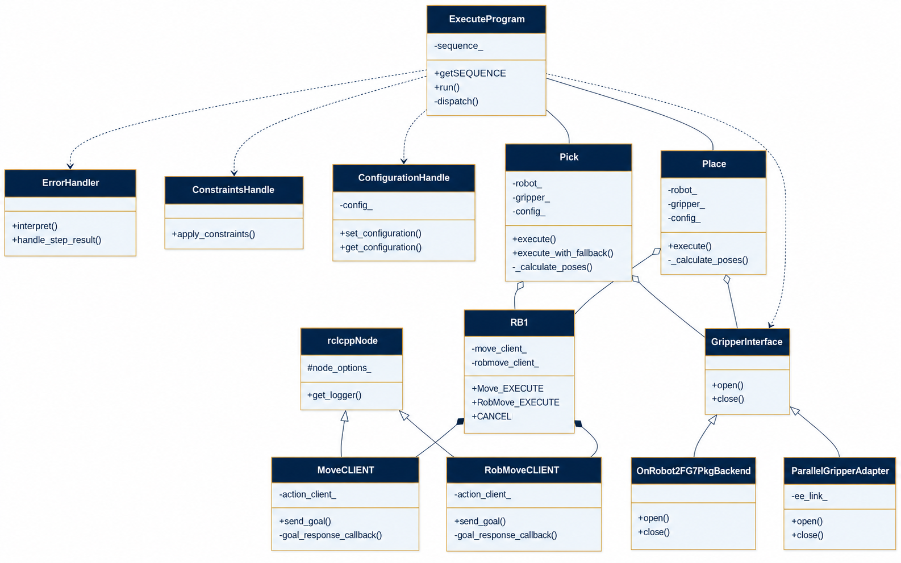

# clair-pick-and-place-ros2

**Sim-to-real pick-and-place for a UR5 arm**, with Tower of Hanoi as the stress-test task.

This ROS 2 Humble workspace adds a high-level execution layer—**Pick**, **Place**, and a YAML **program runner** (`ExecuteProgram`)—that runs the same task logic in **Gazebo** and on a **real UR5** with an **OnRobot 2FG7** gripper. The Hanoi algorithm is small; the engineering work is reliable grasping, motion planning, and sim-to-real integration.


|                 |                                                                            |
| --------------- | -------------------------------------------------------------------------- |
| **Author**      | Mary Bayyouk                                                               |
| **Lab**         | [CLAIR Lab](https://clair.cs.technion.ac.il/), Technion — Computer Science |
| **Supervisors** | David Dovrat, Sarah Keren                                                  |
| **Stack**       | ROS 2 Humble · MoveIt 2 · Gazebo Classic · Universal Robots                |


**Report & poster:** [poster/report/REPORT.md](poster/report/REPORT.md) · [CLAIR_poster.pdf](poster/report/CLAIR_poster.pdf)

---


## Primary use cases


| Use case          | Hardware                          | Config  | Launch                                               | Programs / demos                 |
| ----------------- | --------------------------------- | ------- | ---------------------------------------------------- | -------------------------------- |
| **1. Real robot** | UR5 + **OnRobot 2FG7**            | `ur5_4` | `bringup/bringup_ur.launch.py` with `robot_ip:=<IP>` | `EndEffector: "onrobot_2fg7"`    |
| **2. Simulation** | UR5 + **Robotiq 2F-85** in Gazebo | `ur5_2` | `moveit2.launch.py`                                  | `EndEffector: "ParallelGripper"` |


- **Real:** External PC runs ROS 2; the teach pendant runs the External Control URCap. Motion uses `ur_robot_driver` + MoveIt 2; the gripper uses [onrobot_2fg7](https://github.com/davedovrat/onrobot_2fg7) (XML-RPC on the robot, port **41414**). For `ur5_4`, the URDF keeps **Robotiq 2F-85 geometry** for planning and visualization; the physical tool is the 2FG7. See [OnRobot 2FG7 setup](doc/OnRobot2FG7Setup.md).
- **Sim:** Gazebo + MoveIt 2 + ros2_control; same task layer with `ParallelGripper` (LinkAttacher + MoveG).

Legacy **RG2/RG6** over Tool I/O (`onrobot_ros2`) is still supported via a separate config; see [OnRobot ROS2 setup](doc/OnRobotROS2Setup.md).

---


## Architecture

One task program, two deployment backends:


### Class diagram

HLD-level UML of the execution layer (Pick, Place, robot client, gripper):



More diagrams (control flow, packages, data flow, deployment, ExecuteProgram dispatch): [doc/diagrams/](doc/diagrams/).

### Packages in this workspace


| Package                                                             | Role                                                                                                                    |
| ------------------------------------------------------------------- | ----------------------------------------------------------------------------------------------------------------------- |
| **ros2srrc_launch**                                                 | Launch files: Gazebo + MoveIt 2 (sim), bringup (real UR)                                                                |
| **ros2srrc_execution**                                              | C++ nodes (`move`, `robmove`, `robpose`); Python: ExecuteProgram, Pick/Place, Hanoi demo, gripper clients, spawn/remove |
| **ros2srrc_data**                                                   | Custom messages (e.g. Robpose) and actions (Move, Robmove, Sequence)                                                    |
| **ros2srrc_moveit**                                                 | MoveIt 2 config (SRDF, kinematics) for UR5 and end-effectors                                                            |
| **ros2srrc_robots**                                                 | UR5 URDF/xacro, controller YAML                                                                                         |
| **ros2srrc_endeffectors**                                           | End-effector models (parallel gripper for sim; geometry shared with real planning)                                      |
| **ros2srrc_ur5**                                                    | Robot configurations (`ur5_2` sim, `ur5_4` real + 2FG7)                                                                 |
| **ros2srrc_gazebo**                                                 | Gazebo worlds                                                                                                           |
| **gazebo_ros2_control**, **IFRA_LinkAttacher**, **IFRA_ObjectPose** | Simulation support (in-tree)                                                                                            |


---


## Dependencies

- Ubuntu 22.04 LTS, ROS 2 **Humble**
- [MoveIt 2](https://moveit.ros.org/) (`ros-humble-moveit`)
- [ros2_control](https://control.ros.org/) (`ros-humble-ros2-control`, `ros-humble-ros2-controllers`, `ros-humble-gripper-controllers`)
- [Gazebo Classic](https://gazebosim.org/) and `ros-humble-gazebo-ros-pkgs`
- In-tree: **ros2srrc_data**, **ros2_linkattacher**, **ros2_objectpose**, **ros2_linkpose**
- Real UR5: [Universal Robots ROS 2 Driver](https://github.com/UniversalRobots/Universal_Robots_ROS2_Driver) (`ros-humble-ur`)
- Real gripper: [onrobot_2fg7](https://github.com/davedovrat/onrobot_2fg7) — see [OnRobot 2FG7 setup](doc/OnRobot2FG7Setup.md)
- Real UR networking / URCap: [Real robot setup](doc/RealRobotSetup.md) · [Walkthrough](doc/RealRobotWalkthrough.md)

---


## Installation

Assumes Ubuntu 22.04 and a workspace at `~/clair-pick-and-place-ros2` (adjust paths if needed).

### 1. ROS 2 Humble and system packages

```bash
sudo apt update
sudo apt install -y \
  ros-humble-desktop \
  ros-dev-tools \
  ros-humble-moveit \
  ros-humble-xacro \
  ros-humble-ros2-control \
  ros-humble-ros2-controllers \
  ros-humble-gripper-controllers \
  ros-humble-gazebo-ros-pkgs \
  ros-humble-gazebo-ros2-control \
  ros-humble-rmw-cyclonedds-cpp \
  gazebo
```

If apt reports a conflicting `Signed-By` for `packages.ros.org`, remove the duplicate repo entry:

```bash
sudo rm /etc/apt/sources.list.d/ros2.list   # keep ros2.sources if both exist
sudo apt update
```


### 2. Clone and build

```bash
cd ~
git clone https://github.com/marybayyouk/clair-pick-and-place-ros2.git
cd ~/clair-pick-and-place-ros2
rosdep update
rosdep install --from-paths src --ignore-src -r -y
colcon build
```

For the real 2FG7 gripper, also import and build the driver packages:

```bash
vcs import src --input repos/onrobot_2fg7.repos
colcon build --symlink-install
source install/setup.bash
```


### 3. MoveIt header patch (required once)

```bash
sudo cp ~/clair-pick-and-place-ros2/src/ros2_SimRealRobotControl/include/move_group_interface_improved.h \
  /opt/ros/humble/include/moveit/move_group_interface/
```

See `src/ros2_SimRealRobotControl/include/README.md` for details.

### 4. Shell environment

Add to `~/.bashrc` (once):

```bash
source /opt/ros/humble/setup.bash
source ~/clair-pick-and-place-ros2/install/setup.bash
export RMW_IMPLEMENTATION=rmw_cyclonedds_cpp
```

Then `source ~/.bashrc` (or open new terminals). Verify:

```bash
echo $ROS_DISTRO          # humble
ros2 pkg list | grep ros2srrc_execution
```


### Helper scripts

From the workspace root:


| Script                | Purpose                                    |
| --------------------- | ------------------------------------------ |
| `source setup_env.sh` | Source ROS + workspace                     |
| `./launch_sim.sh`     | Start Gazebo + MoveIt 2 (`ur5_2`)          |
| `./run_hanoi.sh [N]`  | Run Hanoi demo with `N` cubes (default: 2) |


---


## Topics and parameters


### Topics (project-relevant)


| Direction | Topic                                  | Role                                                            |
| --------- | -------------------------------------- | --------------------------------------------------------------- |
| Sub / pub | `/Robpose`                             | End-effector pose (`robpose` publishes; task scripts subscribe) |
| Sub       | `/object_poses/<name>`                 | Object pose (`nav_msgs/Odometry`) for pick/place and Hanoi      |
| Pub       | `/planning_scene`, `/collision_object` | Collision updates for MoveIt                                    |


### Parameters introduced by this project


| Parameter     | Meaning                                         | Default   | Where                                  |
| ------------- | ----------------------------------------------- | --------- | -------------------------------------- |
| **ROB_PARAM** | MoveIt planning group (e.g. `ur5`)              | `none`    | `move`, `robmove`, `robpose`           |
| **EE_PARAM**  | MoveIt end-effector group (e.g. `robotiq_2f85`) | `none`    | `move` (from config `moveit_ee_group`) |
| **robot_ip**  | Real robot IP for bringup                       | *(empty)* | `bringup/bringup_ur.launch.py`         |


`use_sim_time` is set by launch files for simulation; it is a standard ROS 2 parameter.

---


## Usage

Source the workspace before any `ros2` command. If you see `Package 'ros2srrc_execution' not found`, run `source ~/.bashrc`.

### Simulation (Gazebo + MoveIt 2)

**Terminal 1 — start simulation:**

```console
cd ~/clair-pick-and-place-ros2
./launch_sim.sh
```

Or:

```console
source /opt/ros/humble/setup.bash
source ~/clair-pick-and-place-ros2/install/setup.bash
ros2 launch ros2srrc_launch moveit2.launch.py package:=ros2srrc_ur5 config:=ur5_2
```

Wait until Gazebo and MoveIt 2 are fully loaded.

In simulation, the UR5 sits on a `robot_stand` from the URDF (tabletop at z ≈ 0.84 m). After editing those xacro files, rebuild with `colcon build --packages-select ros2srrc_ur5` and relaunch.

**Terminal 2 — run a task program:**

```console
source /opt/ros/humble/setup.bash
source ~/clair-pick-and-place-ros2/install/setup.bash
ros2 run ros2srrc_execution ExecuteProgram.py package:=ros2srrc_execution program:=ur5_pick_and_place
```

Programs live in `ros2srrc_execution/programs/`. Optional step types include **SetConstraints** and **SetConfiguration**.

### Real UR5 (OnRobot 2FG7, config `ur5_4`)

Install the 2FG7 driver first — [OnRobot 2FG7 setup](doc/OnRobot2FG7Setup.md). Then:

```console
source /opt/ros/humble/setup.bash
source ~/clair-pick-and-place-ros2/install/setup.bash
ros2 launch ros2srrc_launch bringup/bringup_ur.launch.py package:=ros2srrc_ur5 config:=ur5_4 robot_ip:=<ROBOT_IP>
```

```console
ros2 run ros2srrc_execution ExecuteProgram.py package:=ros2srrc_execution program:=ur5_pick_and_place_onrobot
```

Gripper-only check: `ros2 run ros2srrc_execution test_2fg7_connectivity.py`

### Stopping

Use Ctrl+C in each terminal. On the **real robot**, stop ExecuteProgram / Pick / Place first, then the bringup launch. Stop the External Control program on the teach pendant when you want to release control.

---


## Running the Hanoi demo


### Simulation (Gazebo)

1. **Terminal 1** — start Gazebo + MoveIt (`ur5_2`):
  ```console
   cd ~/clair-pick-and-place-ros2
   ./launch_sim.sh
  ```
2. **Terminal 2** — run the demo:
  ```console
   cd ~/clair-pick-and-place-ros2
   ./run_hanoi.sh 3
  ```
   Or:
   Useful options: `--num_cubes` (1–8), `--peg_spacing`, `--stand_z`, `--peg_x`, `--peg_center_y`, `--skip_spawn`, `--initial_state`. (`--table_z` is deprecated; use `--stand_z`.)

  | Cubes | Moves | Approx. runtime |
  | ----- | ----- | --------------- |
  | 2     | 3     | a few minutes   |
  | 3     | 7     | ~10 min         |
  | 5     | 31    | 30+ min         |

   Cubes spawn on the robot stand; pegs lie along **Y**. If pick/place reports `NO_IK_SOLUTION`, move `--peg_x` toward the reachable side of the base (often negative X with the default mount).


### Real UR5 (OnRobot 2FG7)

1. **Terminal 1** — bringup with `ur5_4` ([Real robot setup](doc/RealRobotSetup.md), [2FG7 setup](doc/OnRobot2FG7Setup.md)):
  ```console
   source /opt/ros/humble/setup.bash
   source ~/clair-pick-and-place-ros2/install/setup.bash
   ros2 launch ros2srrc_launch bringup/bringup_ur.launch.py package:=ros2srrc_ur5 config:=ur5_4 robot_ip:=<ROBOT_IP>
  ```
2. **Terminal 2** — use `--skip_spawn` and the validated peg layout. Object poses must be on `/object_poses/<name>` (`nav_msgs/Odometry`):
  ```console
   ros2 run ros2srrc_execution hanoi_tower_demo.py \
     --num_cubes 2 \
     --peg_layout real_2fg7 \
     --skip_spawn \
     --ee_type onrobot_2fg7 \
     --ee_link EE_robotiq_2f85 \
     --robot ur5
  ```
   Validated peg marks for the lab cell are documented in [OnRobot 2FG7 setup](doc/OnRobot2FG7Setup.md).

---


## Documentation


| Document                                                         | Contents                                                        |
| ---------------------------------------------------------------- | --------------------------------------------------------------- |
| [poster/report/REPORT.md](poster/report/REPORT.md)               | Project report (architecture, sim vs real, challenges, results) |
| [poster/report/CLAIR_poster.pdf](poster/report/CLAIR_poster.pdf) | Research poster PDF                                             |
| [doc/diagrams/](doc/diagrams/)                                   | Architecture diagram sources and SVGs                           |
| [doc/OnRobot2FG7Setup.md](doc/OnRobot2FG7Setup.md)               | Real OnRobot 2FG7 install and bringup                           |
| [doc/RealRobotSetup.md](doc/RealRobotSetup.md)                   | UR networking, URCap, External Control                          |
| [doc/RealRobotWalkthrough.md](doc/RealRobotWalkthrough.md)       | Step-by-step first motions on hardware                          |
| [doc/OnRobotROS2Setup.md](doc/OnRobotROS2Setup.md)               | Legacy RG2/RG6 (`onrobot_ros2`) path                            |


---


## Troubleshooting


| Symptom                                         | Fix                                                                                                              |
| ----------------------------------------------- | ---------------------------------------------------------------------------------------------------------------- |
| `Package 'ros2srrc_execution' not found`        | `source ~/.bashrc` or `source …/install/setup.bash`                                                              |
| `move_group_interface_improved.h: No such file` | Run the [MoveIt header patch](#3-moveit-header-patch-required-once)                                              |
| `MoveG:FAILED` on gripper close (sim)           | Rebuild, relaunch; ensure gripper controllers load from installed `ros2srrc_endeffectors` paths                  |
| Orange “ghost” robot in RViz                    | MoveIt goal-state overlay; restart `./launch_sim.sh`                                                             |
| Pick fails on stacks (`INVALID_MOTION_PLAN`)    | Only the **target** cube is removed from the planning scene; try `--peg_spacing 0.25` for 5+ cubes               |
| Hanoi `NO_IK_SOLUTION`                          | Pegs may be out of reach; set `--peg_x` on the reachable side of the stand (UR5 reach ≈ 0.85 m from `base_link`) |
| Apt `Signed-By` conflict for ROS repo           | Remove duplicate `ros2.list`; keep `ros2.sources`                                                                |


During pick, only the cube being grasped is temporarily removed from the MoveIt planning scene so the gripper can descend; other cubes stay as collision objects.

VM testing notes: `src/ros2_SimRealRobotControl/TESTING_GUIDE_ROS2_VM.md`.

---


## License

Apache License, Version 2.0 — see [LICENSE](LICENSE). Third-party packages (IFRA_*, gazebo_ros2_control, etc.) are acknowledged in [NOTICE](NOTICE).