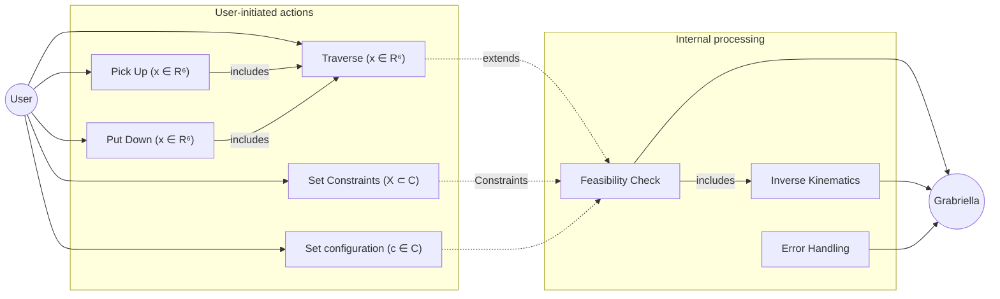
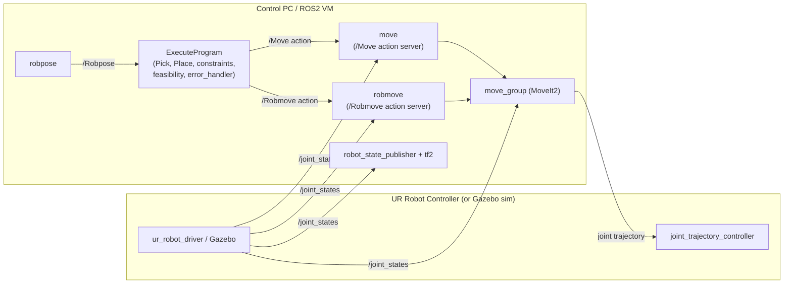
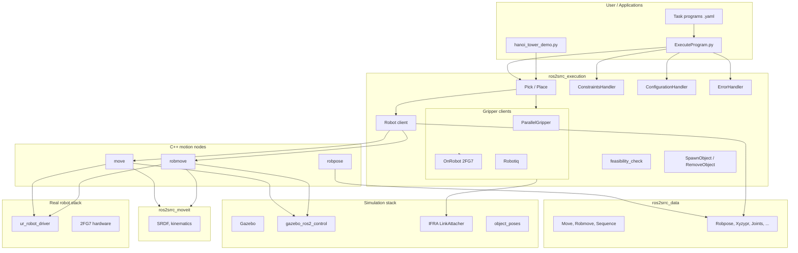
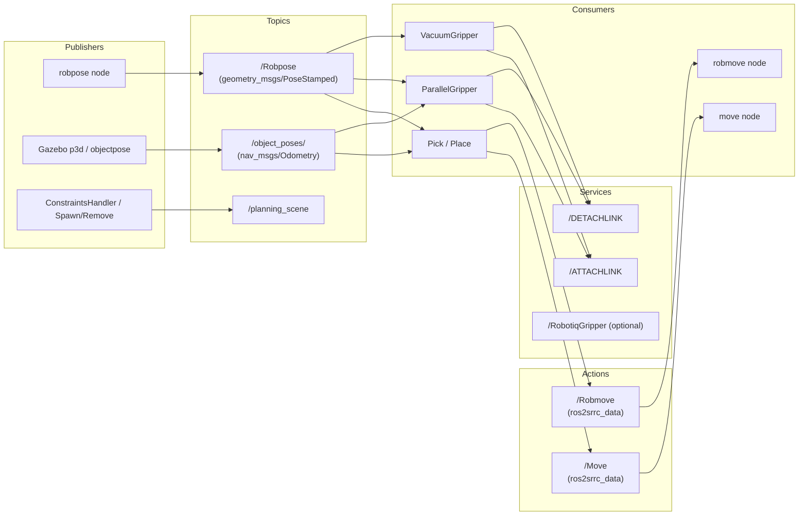
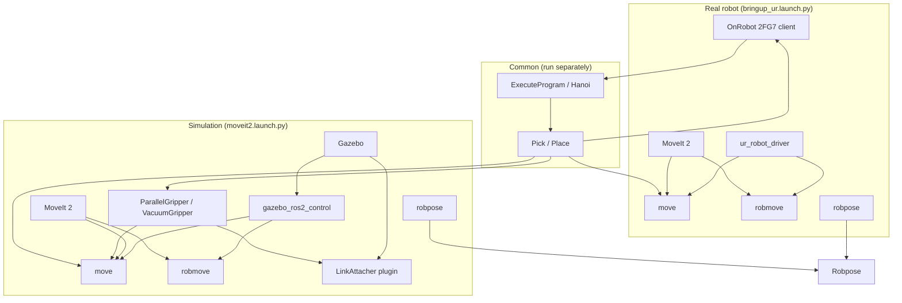

# Architecture Diagram

This document describes the architecture of the **clair-pick-and-place-ros2** (Sim-to-Real Robot Control) workspace: the **HLD (High-Level Design)** and its mapping to layers, packages, components, and data flow for both simulation (Gazebo + MoveIt 2) and real UR5 (OnRobot 2FG7).

---

## 1. HLD — High-level design

The following diagram corresponds to the project’s High-Level Design: **User**-initiated actions, internal processing (feasibility, kinematics, error handling), and the robot **Grabriella**.

- **User actions:** Pick Up, Put Down, Traverse (all with pose *x ∈ R⁶*), Set Constraints (*X ⊂ C*), Set configuration (*c ∈ C*).
- **Internal modules:** Feasibility Check (includes Inverse Kinematics), Error Handling — all inform or control the robot.
- **Relationships:** *includes* (solid), *extends* (dashed), *Constraints* / configuration (dotted).



**HLD → implementation mapping**

| HLD | Implementation |
|-----|----------------|
| Pick Up | `pick.py` / Pick (approach, grasp, retreat) |
| Put Down | `place.py` / Place (approach, release, retreat) |
| Traverse | Robot client: `/Move`, `/Robmove` (move, robmove nodes) |
| Set Constraints | `constraints_handler.py`; program step SetConstraints; `/planning_scene` |
| Set configuration | `configuration_handler.py`; program step SetConfiguration; `configurations.yaml` |
| Feasibility Check | `feasibility_check.py`; MoveIt planning (IK + collision) |
| Inverse Kinematics | MoveIt 2 (used inside Feasibility Check and motion nodes) |
| Error Handling | `error_handler.py`; step result handling (SUCCESS/FAILURE/ABORT) |
| Grabriella | UR5 in simulation (Gazebo) or real (ur_robot_driver + OnRobot 2FG7) |

---

## 2. System layers (implementation)

```
┌─────────────────────────────────────────────────────────────────────────────────┐
│  USER LAYER                                                                      │
│  Task programs · ExecuteProgram · Tower of Hanoi demo                            │
└───────────────────────────────────────────┬─────────────────────────────────────┘
                                            │
                                            ▼
┌─────────────────────────────────────────────────────────────────────────────────┐
│  EXECUTION LAYER (ros2srrc_execution)                                            │
│  Pick / Place · SetConstraints · SetConfiguration · ErrorHandler · Feasibility   │
│  Gripper clients: ParallelGripper (Gazebo) · OnRobot 2FG7 · Robotiq (optional)  │
│  Actions: /Move, /Robmove   Topic: /Robpose   Services: /ATTACHLINK, /DETACHLINK │
└───────────────────────────────────────────┬─────────────────────────────────────┘
                                            │
                                            ▼
┌─────────────────────────────────────────────────────────────────────────────────┐
│  MOTION LAYER (C++ nodes)                                                        │
│  move · robmove · robpose  (MoveIt 2 + ROS 2 Control)                            │
└───────────────────────────────────────────┬─────────────────────────────────────┘
                                            │
              ┌─────────────────────────────┴─────────────────────────────┐
              ▼                                                           ▼
┌───────────────────────────────────┐                     ┌─────────────────────────────────┐
│  SIMULATION                       │                     │  REAL ROBOT                     │
│  Gazebo · world · object poses    │                     │  Universal Robots driver        │
│  gazebo_ros2_control              │                     │  OnRobot 2FG7 (XML-RPC/URScript)│
│  IFRA LinkAttacher (attach/detach)│                     │  ur_robot_driver                │
└───────────────────────────────────┘                     └─────────────────────────────────┘
```

---

## 3. Control flow: Robot + Control PC (ROS 2 VM)

This diagram aligns with the current workspace: **ExecuteProgram** (with Pick, Place, constraints, feasibility semantics, and error handling in-process) talks to the **move** and **robmove** action servers; those C++ nodes use **MoveIt 2** (move_group) for planning and execution; the **joint_trajectory_controller** receives the trajectory. There are no separate `/user_command`, `/pick_place_status`, `/planned_trajectory`, `/feasibility_result`, or `/error_notifications` topics — orchestration and error handling are inside ExecuteProgram.



- **ExecuteProgram** runs the YAML program and dispatches steps (SetConfiguration, SetConstraints, MoveJ, RobMove, Pick, Place, gripper). It uses the **Robot client** (RBT) to send **/Move** and **/Robmove** goals. Feasibility is implicit when **move**/ **robmove** plan (MoveIt); **error_handler** is called in-process after each step (no topic).
- **move** and **robmove** use MoveIt’s MoveGroupInterface (plan + execute); **move_group** is used internally. Trajectory is sent to **joint_trajectory_controller** via ros2_control.
- **robpose** publishes **/Robpose** (current EE pose); Pick/Place and grippers subscribe when needed.
- **/joint_states** from **ur_robot_driver** (real) or Gazebo (sim) feed **robot_state_publisher**, **move_group**, and the motion nodes.

---

## 4. Component & package diagram



---

## 5. Package dependency layers

| Layer        | Packages | Role |
|-------------|----------|------|
| **Launch**  | ros2srrc_launch | moveit2.launch.py (Gazebo+MoveIt), bringup_ur.launch.py (real UR). |
| **Execution** | ros2srrc_execution | ExecuteProgram, Pick/Place, Hanoi demo, gripper clients, Spawn/Remove, C++ move/robmove/robpose. |
| **Data**    | ros2srrc_data | Custom actions (Move, Robmove, Sequence), messages (Robpose, Xyzypr, etc.). |
| **Motion**  | MoveIt 2, ros2srrc_moveit | Planning, kinematics, SRDF. |
| **Robot**   | ros2srrc_robots, ros2srrc_ur5 | URDF/xacro, controller YAML, configs (ur5_2 sim, ur5_4 real+2FG7). |
| **End-effectors** | ros2srrc_endeffectors | Parallel gripper (sim), OnRobot 2FG7, Robotiq models. |
| **Sim**     | ros2srrc_gazebo, gazebo_ros2_control, IFRA_LinkAttacher, IFRA_ObjectPose | Worlds, control plugin, attach/detach, object pose. |
| **External** | ros2_RobotiqGripper, Universal_Robots_ROS2_Driver | Robotiq service (optional), real UR driver. |

---

## 6. Data flow: topics, actions, services



**Summary:**

- **Published:** `/Robpose` (EE pose), `/object_poses/<name>` (object pose in sim or from perception), `/planning_scene` (collision objects).
- **Subscribed:** Execution and grippers use `/Robpose` and `/object_poses/<name>`; MoveIt uses `/planning_scene`.
- **Actions:** Execution layer calls `/Move` and `/Robmove`; C++ nodes `move` and `robmove` are the servers.
- **Services:** `/ATTACHLINK`, `/DETACHLINK` (IFRA LinkAttacher in Gazebo); optionally `/RobotiqGripper` for Robotiq gripper.

---

## 7. Deployment: simulation vs real robot



- **Simulation:** Gazebo + gazebo_ros2_control + LinkAttacher; motion via `move`/`robmove`; gripper via ParallelGripper or VacuumGripper (attach/detach in Gazebo).
- **Real:** ur_robot_driver + MoveIt 2; same `move`/`robmove`/`robpose`; gripper via OnRobot 2FG7 (XML-RPC or URScript).
- **Common:** ExecuteProgram and Pick/Place are the same; only config (e.g. ur5_2 vs ur5_4) and gripper backend change.

---

## 8. ExecuteProgram step dispatch (simplified)

```mermaid
flowchart LR
    YAML[program.yaml] --> Seq[Sequence]
    Seq --> S1[SetConfiguration]
    Seq --> S2[SetConstraints]
    Seq --> S3[MoveJ / RobMove]
    Seq --> S4[Pick]
    Seq --> S5[Place]
    Seq --> S6[ParallelGripper / 2FG7 / Robotiq]
    Seq --> S7[Traverse]

    S4 --> RBT[Robot client]
    S4 --> GRIP[Gripper]
    S5 --> RBT
    S5 --> GRIP
    S6 --> GRIP
    S1 --> Config[ConfigurationHandler]
    S2 --> Constraints[ConstraintsHandler]
    S3 --> RBT
    S7 --> RBT

    RBT --> Move[/Move]
    RBT --> Robmove[/Robmove]
    GRIP --> Attach[/ATTACHLINK]
    GRIP --> Detach[/DETACHLINK]
    Constraints --> Planning[/planning_scene]
```

---

## 9. Class diagram (execution layer)

See the README for the full Mermaid class diagram of `ExecuteProgram`, `Pick`, `Place`, `RBT`, `MoveCLIENT`, `RobMoveCLIENT`, `GripperInterface`, `OnRobot2FG7Backend`, and `ParallelGripperAdapter`.

---

**SVG export:** Mermaid sources and SVG generation are in **[doc/diagrams/](diagrams/)**. To get an SVG for each diagram: open `doc/diagrams/render_diagrams.html` in a browser and use each “Download …” button, or install Node.js and run `doc/diagrams/generate_svgs.sh`.

---

*Generated for the clair-pick-and-place-ros2 workspace. Packages: ros2srrc_launch, ros2srrc_execution, ros2srrc_data, ros2srrc_moveit, ros2srrc_robots, ros2srrc_endeffectors, ros2srrc_ur5, ros2srrc_gazebo; external: IFRA_LinkAttacher, IFRA_ObjectPose, gazebo_ros2_control, ros2_RobotiqGripper, Universal_Robots_ROS2_Driver.*
