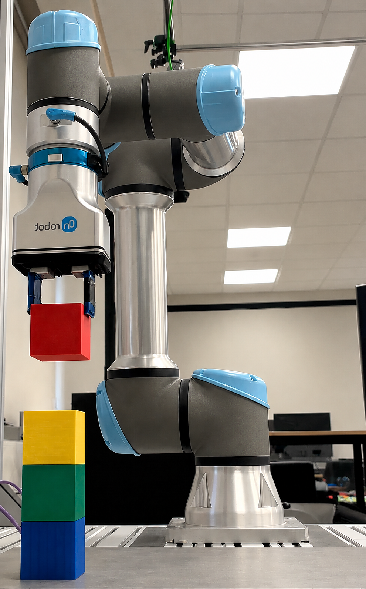
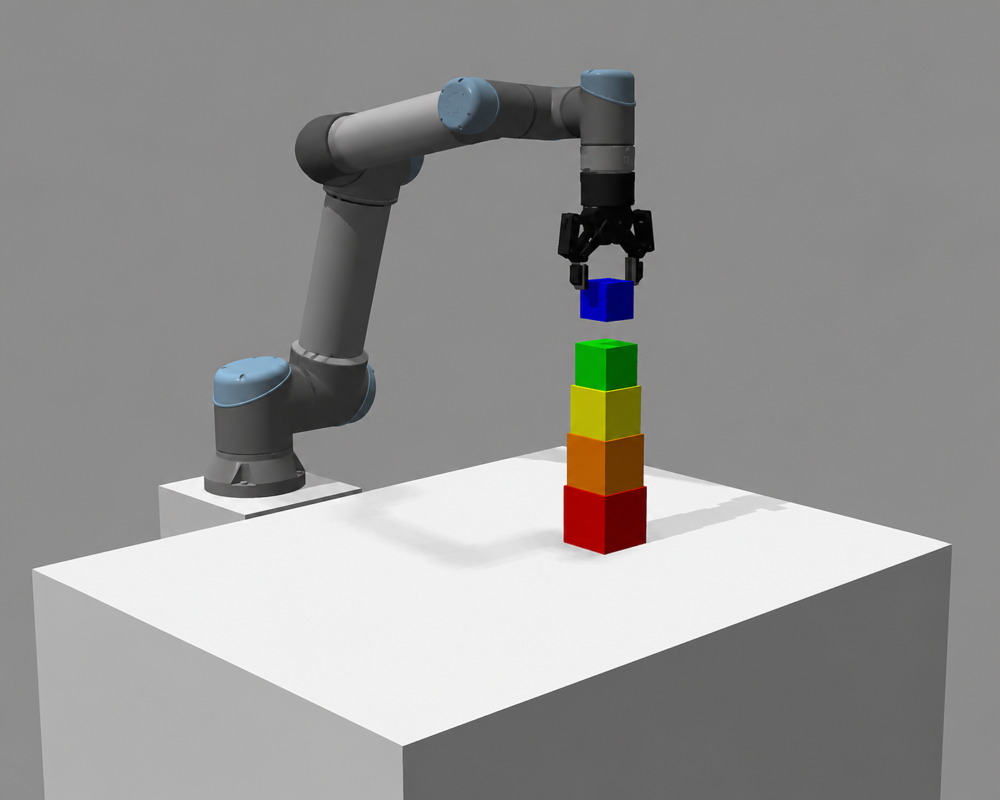

# When Simulation Meets Reality: Sim-to-Real Pick-and-Place for Tower of Hanoi

Mary Bayyouk  
Supervisors: David Dovrat, Sarah Keren  
CLAIR Lab, Technion — Computer Science  
July 2026



---

## 1. Project Overview

In this project I built a pick-and-place pipeline for a UR5 arm that runs in Gazebo and on a real robot with an OnRobot 2FG7 gripper. I used Tower of Hanoi as the main task to stress-test repeated picks and places on stacked blocks.

### Problem definition

**Problem.** The UR5 must perform reliable pick-and-place: grasp a block at one pose, move it, and release it at another. Each pick is approach → descend → close gripper → lift; each place is approach → descend → open gripper → retreat. I used Tower of Hanoi as the test task — every legal move is one pick and one place on stacked blocks — but the core problem is pick-and-place itself, not the puzzle algorithm.

**Goal.** Build high-level **Pick** and **Place** steps that hide motion planning and gripper commands, then run the same task in Gazebo and on the real arm by swapping only the backend (gripper, poses, launch, controllers) — without two separate task codebases.

**Why sim-to-real makes this harder.** Moving from Gazebo to the lab is not a direct copy:

- **Different grippers** — parallel-jaw + LinkAttacher in sim; OnRobot 2FG7 with its own driver on hardware.
- **Different coordinates and geometry** — table height, peg spacing, and block poses must be aligned manually.
- **Motion planning and collision** — plans must avoid the table, pegs, stacks, and the gripper; RViz success does not guarantee execution.
- **Same task logic, different deployment** — Hanoi rules and YAML programs stay fixed; only the environment layer changes.

Sim-to-real is worth it because you can debug task logic in simulation first, then validate on the physical UR5 without rewriting the pick-and-place sequence each time.

**What I assumed at the start.** I mostly expected that if it worked in Gazebo it would work on the real robot with small tweaks. That was only partly true. What stayed the same: the YAML program format, Pick/Place logic, and the idea of one task program for both environments. What did not: the lab and Gazebo are not the same cell (stand height, peg layout, spawn positions); a robot visible in RViz does not mean MoveIt is ready; one good pick is not the same as a reliable Hanoi run; sim and real differ in gripper driver, pose source, TF, and launch config (`ur5_2` vs `ur5_4`). The Hanoi algorithm was never the hard part — integration and tuning were.

  
*Figure 1: Hanoi pseudocode. The algorithm is small; making the robot do it is not.*

---

## 2. System Architecture

The main idea is shown in Figure 2: write the task program once, then plug it into either simulation or the real robot. High-level steps (motion, Pick, Place, gripper) stay the same; what changes is the bottom layer — Gazebo and the simulated gripper in sim, or the UR driver and the 2FG7 on the real arm.

  
*Figure 2: One task program, two deployment paths.*

Figure 3 shows the software layers:

- **Task layer** — YAML programs and the Hanoi demo runner.
- **Pick/Place execution layer** — approach/descend/lift sequences, planning-scene handling, gripper selection (sim vs real).
- **MoveIt motion layer** — motion action servers; MoveIt 2 plans and checks feasibility when those nodes plan trajectories.
- **Simulation backend** — Gazebo, parallel-jaw gripper, IFRA LinkAttacher.
- **Real-robot backend** — UR driver, OnRobot 2FG7 gripper service.

  
*Figure 3: Software layers.*

Most execution code lives in the project's execution package; MoveIt config and robot configs use separate packages for simulation (`ur5_2`) and the real robot (`ur5_4`). Figure 4 shows how the packages connect.

  
*Figure 4: Packages and main modules.*

I did not design this separation from the beginning. I started with sim-only scripts tied to Gazebo; moving to hardware forced abstractions for the gripper, object poses, and launch config so task code did not need separate sim and real paths.

---

## 3. How the System Works

**Main execution flow:**

**YAML / Hanoi → Pick/Place → `/Move` / `/Robmove` → MoveIt → controller → robot**

When a program runs, the task runner (or the Hanoi demo through Pick/Place) sends goals to the motion action servers. Those nodes ask MoveIt to plan, then send the trajectory to the joint controller in Gazebo or on the UR5. Task code uses custom ROS actions and messages — it never calls MoveIt directly from Python.

  
*Figure 5: Control PC and robot/sim.*

**Main ROS interfaces:**

- `/Robpose` — end-effector pose
- `/object_poses/<name>` — block pose (Gazebo or a publisher on real)
- `/Move`, `/Robmove` — motion actions
- `/ATTACHLINK`, `/DETACHLINK` — sim gripper attach/detach
- `/grip` — real 2FG7 gripper
- `/planning_scene` — collision updates from SetConstraints steps

  
*Figure 6: Topics, actions, and services.*

ExecuteProgram loads a YAML sequence, dispatches each step (joint moves, Cartesian moves, Pick, Place, gripper, scene constraints, …), and stops on failure.

  
*Figure 7: How ExecuteProgram handles each step type.*

Pick and Place use a robot motion client and a gripper interface. Simulation uses a parallel-gripper adapter with LinkAttacher; the real robot uses an OnRobot 2FG7 backend.

  
*Figure 8: Main classes in the execution layer.*

### Pick and Place pipelines

Task code passes a block pose (from object-pose topics or Hanoi logic). Pick and Place turn that into motion goals plus gripper commands.

**Pick pipeline:**

1. Open gripper.
2. Planning-scene prep — remove the target cube (and sometimes nearby obstacles) from MoveIt so approach does not collide with the object being grasped.
3. Approach — pose above the block (point-to-point first, linear fallback).
4. Descend — grasp height (with optional extra physical descend on real).
5. Close gripper — LinkAttacher in sim; gripper service on real.
6. Lift — linear move to carry height.

If approach or descend fails, the pick module tries alternate approach height, grasp offset, or gripper orientation before giving up.

**Place pipeline:**

1. Transit (optional) — safe height above target to avoid sweeping over pegs.
2. Approach — above place location (with lower-height retries if planning fails).
3. Scene prep and descend — adjust for stacks, then descend to place pose.
4. Open gripper — release object.
5. Retreat — move back up.

Both pipelines use the same structure in simulation and on the real robot; only the gripper backend and tuning change.

---

## 4. Simulation and Real-Robot Setups

Simulation and real deployment share task code but not launch, gripper, or pose sources:

| | Simulation (`ur5_2`) | Real robot (`ur5_4`) |
|---|----------------------|----------------------|
| Launch | `moveit2.launch.py` | `bringup_ur.launch.py` + robot IP |
| Arm | Gazebo UR5 | UR5 + External Control URCap |
| Gripper | ParallelGripper + LinkAttacher | OnRobot 2FG7 via `/grip` |
| Block poses | Gazebo object-pose topics | Calibrated peg coordinates + pose publisher |
| Controller | `joint_trajectory_controller` | `scaled_joint_trajectory_controller` |
| TF | `world` → `robot_stand` → `base_link` | Static `world` → `base_link` + URDF chain |

  
*Figure 9: Sim vs real deployment.*

### Simulation

Config **`ur5_2`** launches Gazebo, MoveIt 2, and the motion nodes. The URDF includes a robot stand (tabletop ~0.84 m in the world frame). Hanoi cubes spawn on three pegs; Gazebo plugins publish block poses. The same geometry appears as MoveIt collision objects. Cubes initially slipped in physics — I tuned friction, ODE solver settings, and rely on LinkAttacher after close for stable transfers.

  
*Figure 10: Simulation — Gazebo, ParallelGripper, Hanoi board.*

### Real robot

Config **`ur5_4`** launches the UR driver and MoveIt after **External Control** is running on the teach pendant. David Dovrat's OnRobot 2FG7 driver is integrated through a gripper factory so Pick/Place stay hardware-agnostic. Peg positions were measured on the physical board; a small pose publisher feeds the same object-pose topics that simulation uses. Step-by-step bringup is documented in the real-robot walkthrough.

  
*Figure 11: Real robot — UR5 + 2FG7, calibrated pegs.*

---

## 5. Main Challenges and Solutions

Integration problems fell into four groups. The summary table below gives the quick view; each group then explains what happened and how I fixed it.

| Problem | Solution |
|---------|----------|
| Missing kinematics plugin | KDL solver in MoveIt config |
| Bad IK configurations | Point-to-point moves, planner retries, pick fallbacks |
| Collision scene blocked grasp | Temporary removal of target/support objects from MoveIt |
| URDF / SRDF / end-effector mismatch | Consistent config pairing across sim and real setups |
| Sim vs real TF differed | Separate frame configuration per environment |
| Controller active but no motion | Verify broadcaster, trajectory controller, External Control |
| Stacked cubes wrong height | Stack-height computation and real-robot Z offsets |
| Cubes slipped in Gazebo | Physics tuning and LinkAttacher after close |
| Long Hanoi runs unreliable | Peg-state tracking and top-cube verification before each move |
| No 2FG7 ROS driver | Import driver behind gripper abstraction |
| Lab layout ≠ simulation | Tuned stand, pegs, and spawn positions to match hardware |
| Stale workspace builds | Rebuild and re-source after config changes |

### Motion planning

| Problem | Solution |
|---------|----------|
| Missing kinematics configuration | KDL plugin for the arm planning group |
| Bad IK solutions | Point-to-point approach/descend, planner retries, alternate pick candidates |
| Collision scene blocking picks | Remove target (and sometimes support cubes) before approach; restore on failure |

Pose planning initially failed with "No kinematics plugins defined" even though the model looked fine in RViz — the arm group simply had no IK solver. I added a KDL plugin in the kinematics configuration and passed it through the launch files.

The first valid IK was often awkward and failed on the next step. I switched to point-to-point moves for approach and descend where possible, added planner retries in the Cartesian motion node, and built fallback logic into the pick sequence so alternate approach heights, grasp offsets, and orientations are tried before giving up.

Even when IK worked, the virtual target cube often stayed in the MoveIt scene during approach, so the gripper collided with the object it was trying to grasp. Nearby pegs made it worse. The fix was to remove the target (and sometimes support or obstacle cubes) from the planning scene before approach, then restore them if the pick failed.

### Configuration

| Problem | Solution |
|---------|----------|
| URDF / SRDF / end-effector mismatch | Match URDF, SRDF, driver, and tool link in each robot config |
| TF differed between sim and real | No extra static world transform in Gazebo; use it on real bringup |
| Plan visible in RViz but arm still | Ensure joint broadcaster + correct trajectory controller are active |

Each UR5 config (`ur5_1`–`ur5_4`) must pair URDF, SRDF, driver, and end-effector link consistently. A mismatch broke MoveIt or LinkAttacher even when RViz looked fine. On the real setup, MoveIt still uses Robotiq 2F-85 collision geometry while the physical tool is the 2FG7 — planning works but clearances are approximate.

In Gazebo, an extra static world-to-base transform conflicts with the URDF chain; real bringup uses that transform. I kept poses and collision objects in the world frame and avoided duplicate robot-state publishers.

A displayed trajectory does not execute unless the full controller stack is running: joint-state broadcaster plus the trajectory controller in sim, or scaled trajectory controller plus UR driver plus External Control on real.

### Manipulation

| Problem | Solution |
|---------|----------|
| Stacked cube handling | Compute height from stack position; pass support-cube info into Pick/Place |
| Gazebo grasp stability | Friction/damping in cube model, ODE tuning, LinkAttacher after close |
| Full Hanoi sequence reliability | Track peg state; verify expected top cube; update only after success |

Hanoi usually picks the top of a stack, not an isolated block. The demo computes cube height from stack position, passes support-cube information into Pick/Place, and applies extra Z offsets on the real robot for stacked pick and place.

Cubes slipped in Gazebo despite valid MoveIt plans. Raising friction and damping in the cube model, tuning the ODE solver, and attaching with LinkAttacher after close made stacked picks repeatable enough for multi-move runs in simulation.

One pick-and-place is easy; 31 moves for five cubes is not. I track peg state, verify the expected top cube before each move, update state only after success, and abort later moves if logic and physics diverge.

### Real deployment

| Problem | Solution |
|---------|----------|
| 2FG7 integration | Gripper abstraction so Pick/Place call a common interface |
| Lab vs sim alignment | Match stand size, peg spacing, and spawn heights to the physical board |
| Build and dependency issues | Rebuild affected packages after config changes |

No ready ROS 2 driver existed for our 2FG7 setup when I started real deployment. I imported David Dovrat's driver and kept Pick/Place behind a gripper interface so task code never calls the driver directly.

I first treated Gazebo as a generic UR5 on a table. I tuned stand size, peg spacing, and cube spawn heights to match the measured Hanoi board on the lab floor.

Many packages had to build in the right order. Stale build output after configuration changes caused confusing errors until I rebuilt the affected packages and re-sourced the workspace.

---

## 6. Results

Hanoi pick-and-place runs in Gazebo and on the physical UR5 using the same high-level path: Pick/Place steps driven by the Hanoi demo, with only launch config, gripper backend, and pose source changing between environments.

| Test | Simulation | Real robot |
|------|------------|------------|
| Single pick and place | Successful | Successful |
| Stacked pick and place | Successful | Successful |
| Hanoi size tested | 3–5 cubes | 2–3 cubes |
| Pose source | Gazebo object poses | Calibrated peg coordinates |
| Gripper | LinkAttacher (sim) | OnRobot 2FG7 |

**What this means in practice.** Single-cube and stacked pick-and-place both work in simulation and on hardware after tuning approach heights and gripper close percentage. In simulation I ran full multi-move Hanoi sequences with three to five cubes repeatedly during development. On the real arm I ran shorter calibrated sequences with two to three cubes — enough to validate the same task logic on hardware without claiming full five-cube reliability on the lab floor. I did not log a formal success-rate spreadsheet; the evidence above reflects tests I actually ran and repeated until stable, not a controlled benchmark study.

Screenshots for both environments appear in Section 4 (Figures 10 and 11).

---

## 7. My Contributions

A central outcome of this project is building **high-level manipulation primitives** on top of low-level robot instructions. By constructing **Pick** and **Place** from MoveJ/RobMove goals, gripper open/close, and MoveIt planning-scene updates, the task layer no longer deals with joint trajectories or IK directly. That sets the stage for future **task and motion planning** work at CLAIR — new demos can compose the same primitives (or add new ones) in YAML or Python without reimplementing motion planning for each task.

**What I personally added or extended** (on top of the existing `ros2srrc_*` workspace, MoveIt 2, Gazebo, and the UR driver):

- **Pick and Place execution layer** — refined `pick_manual.py` / `place_manual.py` with approach/descend/lift sequences, `_prepare_scene_for_pick` collision handling, and `execute_with_fallback` for alternate grasps.
- **Primitive-based task interface** — wired Pick/Place into `ExecuteProgram.py` step dispatch and `hanoi_tower_demo.py` so tasks are expressed as named steps, not raw motion calls.
- **Hanoi stack logic** — peg state tracking, `expected_cube_index` verification, stacked height computation (`get_cube_z`), and real-robot Z offsets for stacked pick/place.
- **Gripper backend abstraction** — `gripper_factory.py` and `GripperInterface` with `ParallelGripperAdapter` (sim) and `OnRobot2FG7PkgBackend` (real), integrating David Dovrat's `onrobot_2fg7` driver without changing Pick/Place code.
- **Sim-to-real configuration** — aligned `ur5_2` (sim) and `ur5_4` (real) in `configurations.yaml`, KDL kinematics for `ur5_arm`, and sim world tuning to match the lab stand and peg layout.
- **Real pose publisher** — `hanoi_publish_pose.py` on `/object_poses/<name>` so Pick/Place read the same topic in sim and on hardware.
- **Documentation** — `doc/RealRobotWalkthrough.md` and alignment with `doc/OnRobot2FG7Setup.md`.

**What I built on rather than authored from scratch:** the C++ motion nodes (`move`, `robmove`, `robpose`), `ros2srrc_data` action/message definitions, the base ExecuteProgram YAML framework, MoveIt configuration packages, and the `onrobot_2fg7` driver (David Dovrat).

---

## 8. Discussion and Future Work

### Limitations

- **No vision** — simulation uses Gazebo ground truth; the real robot uses manually published poses. There is no camera-based cube detection.
- **Approximate 2FG7 collision model** — the real-robot MoveIt config still uses Robotiq 2F-85 geometry; clearances are approximate.
- **Manual calibration** — peg layout and grasp offsets are measured and hand-tuned; moving the board requires recalibration.
- **Limited recovery after failure** — a failed grasp mid-sequence aborts rather than replanning automatically.

### Lessons learned

Tower of Hanoi is trivial as an algorithm and difficult as a robotics demo. Sim-to-real is mostly about interfaces — keeping task logic fixed while swapping deployment made it easier to isolate bugs. I should have tested on the real arm earlier; many wrong assumptions only appeared under External Control on the lab floor. The extra layers (gripper interface, YAML programs, planning-scene handling) felt like overhead at first but avoided maintaining separate sim and real task code.

### Future work

Build on the Pick/Place primitives for richer task and motion planning at CLAIR — perception-backed poses, a MoveIt model matched to the 2FG7, composable YAML tasks beyond Hanoi, and automatic calibration and recovery after failed grasps.

### Conclusion

I built a sim-to-real pick-and-place pipeline for Tower of Hanoi on a UR5 around one idea: compose the task once from high-level Pick and Place steps, then swap the simulation or real-robot backend underneath. Simulation needed as much debugging as the real robot — kinematics, collision, physics, configs, TF — before hardware-specific issues even entered the picture. The primitive layer is what I hope CLAIR can extend next: new tasks should plug into the same Pick/Place interface rather than rewriting low-level motion code.

---

## Appendix A — ROS stack reference

| Layer | Main dependencies |
|--------|-------------------|
| OS / middleware | Ubuntu 22.04, ROS 2 Humble |
| Motion | MoveIt 2, `ros2_control`, KDL kinematics plugin |
| Simulation | Gazebo, `gazebo_ros2_control`, IFRA LinkAttacher |
| Real robot | `ur_robot_driver`, OnRobot 2FG7 URCap + `onrobot_2fg7` |
| Workspace | `ros2srrc_*` packages (execution, moveit, ur5, launch, data) |

**Runtime nodes:** `move` / `robmove` (action servers → MoveIt), `robpose` (`/Robpose`), `move_group`, `ExecuteProgram.py` / `hanoi_tower_demo.py`, `joint_trajectory_controller` / `scaled_joint_trajectory_controller`, `onrobot_2fg7` (real `/grip`), Gazebo plugins (sim poses + LinkAttacher).

---

## Appendix B — Figure index

| Fig | File | Topic |
|-----|------|-------|
| 1 | Tower of hanoi psuedo code.png | Overview |
| 2 | 07-combined-pipeline-architecture.png | Architecture |
| 3 | 00-general-architecture.svg | Layers |
| 4 | 03-component-package.svg | Packages |
| 5 | 02-control-flow-robot-pc.svg | Control flow |
| 6 | 04-data-flow.svg | Data flow |
| 7 | 06-execute-program-dispatch.svg | ExecuteProgram |
| 8 | 07-class-diagram.svg | Classes |
| 9 | 05-deployment.png | Deployment |
| 10 | GazeboRobot.png | Simulation setup |
| 11 | realRobot.png | Real-robot setup |

---

## Appendix C — Commands

Simulation:

```bash
ros2 launch ros2srrc_launch moveit2.launch.py package:=ros2srrc_ur5 config:=ur5_2
ros2 run ros2srrc_execution hanoi_tower_demo.py --num_cubes 3
```

Real robot (External Control on the teach pendant first):

```bash
ros2 launch ros2srrc_launch bringup_ur.launch.py package:=ros2srrc_ur5 config:=ur5_4 robot_ip:=<ROBOT_IP>
ros2 run ros2srrc_execution hanoi_tower_demo.py --num_cubes 2 --peg_layout real_2fg7 --skip_spawn --ee_type onrobot_2fg7
```
